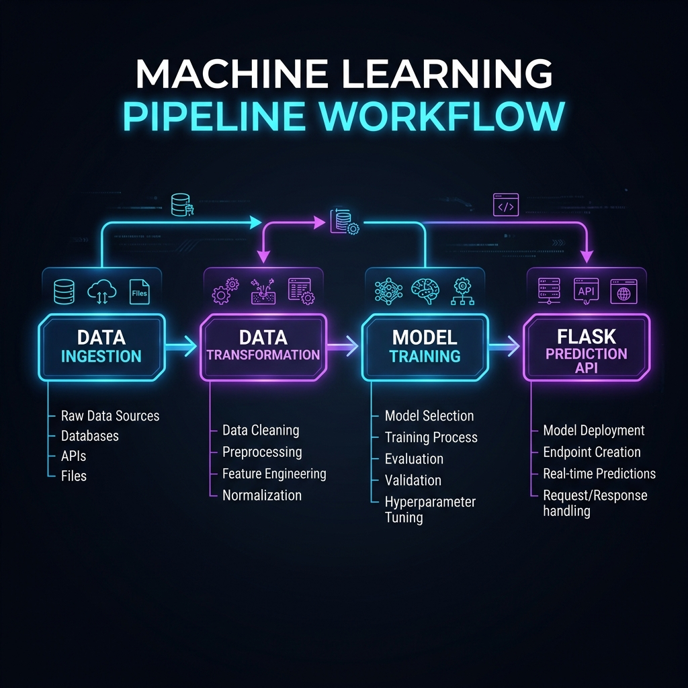

# Student Performance Predictor


## Project Overview

The **Student Performance Predictor** is an End-to-End Machine Learning project designed to understand how students' performance (test scores) is affected by various demographic and background variables such as Gender, Ethnicity, Parental level of education, Lunch, and Test preparation course. 

The project encompasses a complete Machine Learning pipeline, from Data Ingestion and Transformation to Model Training and finally predicting outcomes via a Flask Web Application.

---

## Workflow Diagram



The pipeline is structured with the following key components:

1. **Data Ingestion**: Reading the raw data from its source, and splitting it into train and test datasets.
2. **Data Transformation**: Preprocessing data, handling missing values, standardizing numerical features, and encoding categorical features using a modular approach.
3. **Model Training**: Training various machine learning models (e.g., Random Forest, XGBoost, CatBoost) and evaluating them to select the highest performing model.
4. **Prediction Pipeline**: A robust pipeline to process new input data seamlessly and retrieve predictions from the exported trained model.
5. **Web API**: A Flask application (`app.py`) providing a user-friendly interface where users can input student details and instantly get the predicted score.

---

## Directory Structure

```text
.
├── .ebextensions/       # Elastic Beanstalk configurations
├── artifacts/           # Trained models and preprocessors (.pkl files)
├── docs/                # Project documentation and images
├── notebook/            # Jupyter notebooks for EDA and Model Prototyping
├── src/                 # Main source code package
│   ├── components/      # Data Ingestion, Transformation, and Model Trainer modules
│   ├── pipeline/        # Training and Prediction Pipelines
│   ├── exception.py     # Custom exception handling
│   ├── logger.py        # Custom logging functionality
│   └── utils.py         # Reusable utility functions
├── templates/           # HTML templates for the Flask Web App
├── app.py               # Flask application entry point
├── pyproject.toml       # Project metadata and configuration
└── requirements.txt     # Python dependencies
```

## How to Run

1. **Clone the repository** (if you haven't already):
   ```bash
   git clone <repo-url>
   cd mlproject
   ```

2. **Activate the virtual environment**:
   ```bash
   source .venv/bin/activate
   ```

3. **Install the dependencies**:
   ```bash
   pip install -r requirements.txt
   ```

4. **Run the Flask Application**:
   ```bash
   python app.py
   ```

5. **Access the App**:
   Open your browser and navigate to `http://127.0.0.1:5000/predictdata` to use the web application UI.

---

**Author**: Manish (manishkr6)